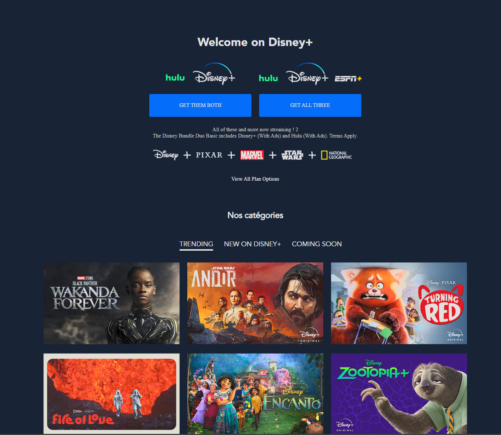

<h1 align="center">🎬 Maquette Disney - Homepage</h1>

  
  
  

---

## 🌍 Présentation | Overview

🇫🇷 Cette maquette représente une page d'accueil inspirée de l’univers **Disney**, réalisée à des fins pédagogiques.  
Elle utilise les technologies **HTML5** et **SCSS** pour reproduire une interface visuellement attrayante et responsive.

🇬🇧 This mockup is a fictional **Disney homepage**, designed for educational purposes.  
It leverages **HTML5** and **SCSS** to provide a visually appealing and responsive layout.

---

## 🚀 Démo en ligne | Live Demo

👉 [Cliquez ici pour voir la démo](https://schatel-dev.github.io/Maquette-Disney/)

  

---

## 🛠️ Technologies utilisées | Technologies Used

  
  
  

---

## 👨‍💻 Auteur | Author

**Sebastien C.**  
🎓 Promo 2025 (Webecom)
📫 [Portfolio GitHub](https://github.com/schatel-dev)

---

## 💖 Remerciements | Show Your Support

Si ce projet vous a été utile ou vous a inspiré, n’hésitez pas à laisser une ⭐ sur le repo !  
If you liked or found this useful, please give it a ⭐️!

---

